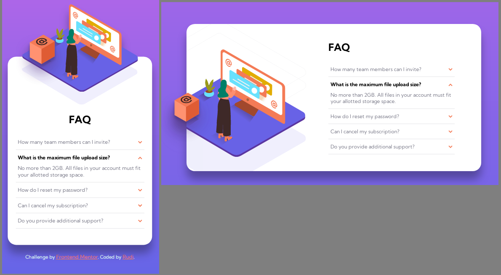

# Frontend Mentor - FAQ accordion card solution

This is a solution to the [FAQ accordion card challenge on Frontend Mentor](https://www.frontendmentor.io/challenges/faq-accordion-card-XlyjD0Oam). Frontend Mentor challenges help you improve your coding skills by building realistic projects.

## Table of contents

- [Overview](#overview)
  - [The challenge](#the-challenge)
  - [Screenshot](#screenshot)
  - [Links](#links)
- [My process](#my-process)
  - [Built with](#built-with)
  - [What I learned](#what-i-learned)
  - [Continued development](#continued-development)
  - [Useful resources](#useful-resources)
- [Author](#author)
- [Acknowledgments](#acknowledgments)

## Overview

### The challenge

Users should be able to:

- View the optimal layout for the component depending on their device's screen size
- See hover states for all interactive elements on the page
- Hide/Show the answer to a question when the question is clicked

- Optional: Complete without the use of Javascript

### Screenshot

### Links

- Solution URL: [FAQ Accordian Card](https://github.com/Drakan21/FAQ-Accordian-Card)
- Live Site URL: [Live website](https://drakan21.github.io/FAQ-Accordian-Card/)

## My process

### Built with

- Semantic HTML5 markup
- Scss/Sass/CSS
- Flexbox
- Mobile-first workflow

### What I learned

- Implementing dynamic components without the use of Javascript

### Continued development

- Refine display scaling / element positioning based on screen sizes.

### Useful resources

- W3Schools [W3Schools](https://www.w3schools.com)
- Sass [Sass-lang.com](http://sass-lang.com/)

## Author

- Frontend Mentor - [@Drakan21](https://www.frontendmentor.io/profile/Drakan21)
- Twitter - [@drakanion](https://www.twitter.com/drakanion)

## Acknowledgments
